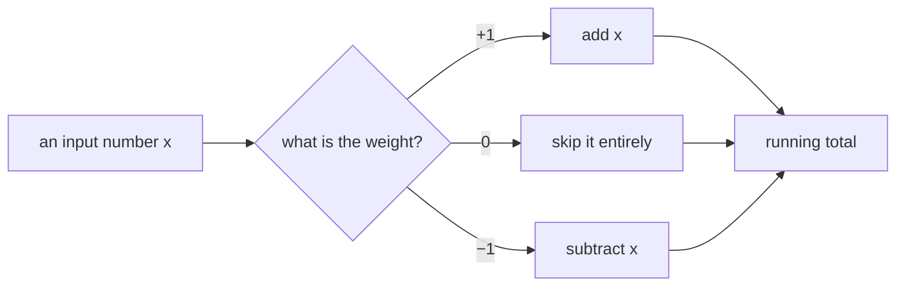
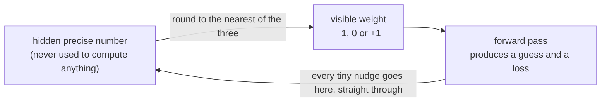
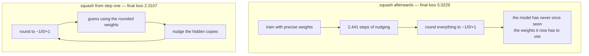
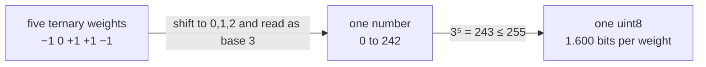

# I built a very stupid language model on purpose

*A language model written from an empty file, where every weight is only −1, 0 or
+1. What that costs, what it buys, and every place I was wrong along the way.*

> I built a language model from scratch where every single weight is only
> **−1, 0, or +1**. Nothing in between.
>
> When your weights can only be those three values, multiplication *disappears* —
> you just add, subtract, or skip. And multiplying is the expensive part of
> running an AI model.
>
> The finished thing is **2.31 MB**. Smaller than a photo on your phone.
>
> It runs entirely in your browser at about **1,045 tokens a second** — no server,
> no API key, nothing leaves your machine.
>
> It is also spectacularly stupid, on purpose, and that turned out to be the most
> interesting part.

---

Every model you use — ChatGPT, Claude, whatever — is at bottom a giant pile of
numbers. Billions of them. Each one is stored as a precise decimal, something
like `0.8371942`, and to produce a single word the model multiplies your input by
millions of these numbers and adds up the results.

Somewhere along the way I read that people were trying something odd: what if
each of those numbers could only ever be **−1, 0, or +1**? Three choices. Nothing
in between.

That sounded like it shouldn't work. So I wanted to find out why it does.

· · ·

## The bit that made it click

Multiplying two arbitrary numbers is genuinely hard work. Try `47 × 89` in your
head, then try `47 + 89`. The second one is trivial. Computer chips feel the same
way — a multiplier circuit costs roughly ten to twenty times the space and
electricity of an adder.

Now think about what happens when a weight can only be −1, 0 or +1:



**The multiplication disappears.** Every hard operation becomes an easy one.
That's the whole idea, and it's why people call these "1-bit" models — although
three options is really about 1.58 bits, and the name stuck anyway.

My model does roughly 11 million of these per token it writes. Turning all of
them from multiplications into additions is the interesting part.

· · ·

## So I built one from scratch to see it happen

Not fine-tuned, not downloaded — written from an empty file. No shortcuts from
the usual libraries. Trained on a free Kaggle GPU, in about fifteen minutes, on a
dataset of simple children's stories.

I built it **seven times**, actually. First a version with almost nothing in it,
then one with a single piece added, then another — retraining each time and
measuring what that one piece was worth. Reading finished code teaches you very
little, because correct code looks obvious in hindsight. Removing something and
watching the damage teaches you a lot.

Here is every rung, measured. "Loss" is how surprised the model is by the next
token, in nats — lower is better, and a fair coin flip would be 0.69.

| rung | what got added | val loss | params added | nats per million params |
|---|---|---|---|---|
| 0 | uniform guess (knows nothing) | 8.3178 | 0 | — |
| 1 | unigram frequencies (counting only) | 6.0380 | 0 | — |
| 2 | embedding + tied head | 5.3828 | 1,310,720 | 0.50 |
| 3 | + one attention layer | 3.9106 | 409,600 | **3.59** |
| 4 | + FFN (squared ReLU) | 3.7150 | 819,200 | 0.24 |
| 5 | + RoPE positions | 3.2948 | **0** | **infinite** |
| 6 | + norms (RMSNorm + SubLN) | 2.4304 | 2,560 | **337.7** |
| 7 | 8 layers | 2.0651 | 8,617,280 | 0.042 |

Drawn as how much surprise each rung actually removed:

```
                                    loss removed by this one addition
  2  embedding + tied head   −2.935  ██████████████████
  3  + one attention layer   −1.472  █████████
  4  + FFN                   −0.196  █
  5  + RoPE  (0 params!)     −0.420  ███
  6  + norms  (2,560 params) −0.864  █████
  7  8 layers                −0.365  ██
```

The thing that surprised me most is sitting right there in rung 6. A handful of
numbers doing "normalisation" — **2,560 of them, about 0.02% of the model** —
removed more than four times as much surprise as the feed-forward network, which
is **320 times larger**. And rung 5 removed 0.42 nats with *zero* new parameters,
because it isn't a component at all; it's a better way of telling the model where
each word sits in the sentence.

Meanwhile the eight-layer stack — 8.6 million parameters, 77% of the whole model
— bought 0.365. Most of the model is the least interesting part of the model.

· · ·

## How you actually train one of these

Training sounds mysterious and isn't. You show the model some text with the next
word hidden. It guesses. You compare its guess to the real answer, and then nudge
every number inside it very slightly in whichever direction would have made it
less wrong.

Then you do that again. And again. Mine did it **2,441 times**, over 20 million
tokens of children's stories — about fifteen million words — on a free graphics
card, in about fifteen minutes.

That's the whole thing. Nobody wrote a rule saying stories begin with "Once upon
a time," or that quotation marks come in pairs, or that a sentence needs a verb.
It read enough stories that the numbers drifted into that shape by themselves.

**But there's an obvious problem when your weights can only be −1, 0 or +1.**

You can't *nudge* a number like that. There's nowhere for it to go. A tiny
adjustment either does absolutely nothing, or flips the thing completely. And
training is entirely built out of tiny adjustments.

The trick is to keep two copies of every weight.



Behind each −1/0/+1 sits a hidden, ordinary, precise number that the model never
actually uses to compute anything. Its only job is to remember. Every tiny nudge
goes into the hidden one. The visible weight is just whichever of the three
values the hidden number happens to be nearest.

So most nudges change nothing you can see. The hidden number shifts a hair, the
visible one stays put. Then eventually one nudge tips it past a boundary — and
the visible weight flips from 0 to +1.

**It's a light switch with a dimmer behind it.** The switch is only ever off or
on. But the dimmer slides smoothly, and when it crosses the middle, the switch
flips.

· · ·

## Three things I didn't expect

### 1. *When* you shrink the numbers matters more than that you shrink them

You can train a model normally and then squash its weights down to −1/0/+1
afterwards. Or you can train it that way from the very first step. Same model,
same final weights, same maths — the only difference is *when*.



Doing it afterwards was catastrophically worse — **2.97 nats worse**, from timing
alone. It's the difference between designing a bridge to the millimetre and then
building it with a metre stick, versus designing it knowing a metre stick is all
you'll ever have.

Here is every version I trained, as how much each choice costs against the
full-precision control:

```
                                  val loss   cost vs fp32 control        file
  fp32 control                     2.0553   ·                          22.32 MB
  ternary body, fp16 embedding     2.1760   ██              +0.121       4.61 MB
  ternary body + ternary embed     2.3107   █████           +0.255       2.31 MB  ← ships
  fp16, shrunk to equal memory     2.3607   ██████          +0.305       4.21 MB
  ternary, squashed afterwards     5.0229   ████████████████████████████████████████████████████████████  +2.968
```

### 2. It's smaller in a way that changes what's possible

The version that ships — ternary body **and** ternary embedding — is
**2,313,205 bytes**. The same architecture stored as fp16 is 22.32 MB, so that's
**9.65× smaller**.

The packing is the neat part. Three values need log₂(3) = 1.585 bits, and you
can't store a third of a bit. But five ternary weights make a base-3 number
between 0 and 242, and 242 fits in a byte:



That's 99.1% of the theoretical floor. The obvious alternative — 2 bits per
weight, 4 per byte — wastes one code in four and would have produced 2.79 MB.

And the packed file isn't an *approximation* of the trained model. It **is** the
trained model:

| check | packed | original | difference |
|---|---|---|---|
| val loss | 2.315797 | 2.315795 | 2 × 10⁻⁶ nats |
| max logit deviation | — | — | 1.14 × 10⁻⁵ |

The one deliberate exception: the 41 normalisation vectors stay fp32. They are
18,240 numbers — 0.16% of the model — and storing them properly costs 36 KB
(+1.6% of the file) while improving fidelity **352×**.

The comparison that matters most is the fourth row of that chart above. At a
*fixed file size*, the ternary model beats the full-precision one — 2.3107
against 2.3607 — because those megabytes buy you five times as many weights.
Ternary loses at equal parameters and wins at equal memory, and memory is what
you actually have.

### 3. On a graphics card it's actually slower

This one was humbling.

| configuration | tok/s | vs fp32 |
|---|---|---|
| fp32 weights, no quantization | 91,926 | 1.00× |
| ternary weights, QAT forward | 53,500 | **1.72× slower** |
| packed → unpacked, activation quantization only | 54,217 | **1.70× slower** |

A GPU is stuffed with multiplier circuits sitting idle whether you use them or
not, so "we removed the multiplications" buys you nothing there. Worse, the
int8 activation quantization that BitNet needs is pure added work — it accounts
for **96.9%** of that overhead, and it's the activations, not the weights.

The advantage needs hardware built for it. That's a real finding and I'd rather
say it than skip it.

· · ·

## From 20 tokens a second to 1,045

At 2.31 MB you can just put the model in a web page, so I did. It downloads once
and then runs on your own machine — no server, nothing sent anywhere. The first
version managed **20 tokens a second**, which is useless.

```
    20  █                                                          plain JS
   110  ██████                                                     branchless, 8 accumulators
   600  ████████████████████████████████                           WASM + SIMD128
   900  ████████████████████████████████████████████████           fixed the sampler
 1,045  ████████████████████████████████████████████████████████   relaxed-SIMD FMA
```

**1. The honest version was the slowest one.** *(20/sec)*

I wrote it exactly the way the theory describes: check whether the weight is +1
and add, −1 and subtract, 0 and skip. Beautiful, and terrible. Modern processors
guess what's coming next before they know, and **31%** of my weights are zero
with the rest split evenly between +1 and −1 — so it could never guess right. It
guessed wrong roughly two-thirds of the time, eleven million times per token.

The naive version — just multiply, don't check anything — was several times
faster than the clever one. The optimisation the whole idea is *named after*
made it slower.

**2. Eight running totals instead of one.** *(110/sec)*

Removed the checking. Then a subtler problem: when you add up a long list into a
single total, each addition has to wait for the one before it to finish. Keep
eight separate totals and combine them at the end, and the processor can work on
all eight simultaneously. Same answer, five times faster.

**3. SIMD — the big one.** *(600/sec)*

SIMD stands for *Single Instruction, Multiple Data*. Normally a processor
multiplies one pair of numbers per instruction. With SIMD it does **four pairs at
once** — one instruction, four lanes. It's widening a one-lane road to four.

JavaScript can't reach those instructions. So I wrote just the innermost loop in
C, compiled it to WebAssembly — **15 KB** — and called it from the page.
Identical maths, four lanes wide. Another 5.5×.

**4. Then I got stuck, and it wasn't the model at all.** *(900/sec)*

Twice I was certain I knew what was slow. Twice I changed it and nothing
happened.

So I stopped guessing and built something that timed every individual piece. It
said the model itself was already running at **1,149 tokens a second** — while
the page was producing **535**. Less than half the time was going into the model.


It was the sampler — my own laziness, in the one box on that diagram that has
nothing to do with AI. To pick from the best 100 of those 4,096 scores I had
written *sort all 4,096, then take the first 100*: about **49,000** comparisons
per token, to throw 3,996 of them away. Replacing it with something that keeps
only the best 100 as it scans through once took the page from 600 to 900.

**5. Multiply and add in one step.** *(1,045/sec)*

Newer browsers support an instruction that multiplies and adds together instead
of doing them separately. Since this model is essentially nothing but
multiply-then-add repeated eleven million times, that's close to halving the
work. I compiled a second version using it, and the page quietly picks whichever
one your browser supports.

**Fifty times faster overall — and the biggest single jump came from measuring
instead of assuming.** The two changes I was most confident about did nothing.
The one I found by accident, in code I'd written without thinking, was worth more
than either.

· · ·

## A word on what this isn't

It is genuinely, deliberately stupid. It forgets who its own characters are after
three sentences. Names change mid-story. A rabbit may fly.

I trained it on about **eleven times less text than it needed**, on purpose. The
rule of thumb says a model this size wants roughly 20 tokens of text per
parameter — 11,159,360 × 20 ≈ 223 million tokens, which at 8,192 tokens per step
is about **27,000 steps**. It got 2,441. I wanted to measure what the 1-bit trick
costs, and holding the data budget small and fixed across all five versions is
what makes those numbers comparable at all.

This is a small attempt to understand something, not a contribution to it. People
who do this properly will spot plenty I got wrong, and I'd genuinely like to hear
it.

· · ·

## Everything in one place

| | |
|---|---|
| **Play with it** | [`standalone/index.html`](../standalone/index.html) — one self-contained file. Drag it onto [Netlify Drop](https://app.netlify.com/drop) and it's live. |
| **Weights** | [huggingface.co/euclidstellar/tinystories-1bit-llm](https://huggingface.co/euclidstellar/tinystories-1bit-llm) |
| **The paper this follows** | [BitNet b1.58 (arXiv:2504.12285)](https://arxiv.org/abs/2504.12285) |

Written up phase by phase, including the parts that didn't work:

- [Phase 1 — the tokenizer and the token stream](../notes/phase-1-tokenizer.md)
- [Phase 2 — the transformer, built seven times](../notes/phase-2-transformer.md)
- [Phase 3 — making it 1-bit](../notes/phase-3-bitlinear.md)
- [Phase 3b — reading what it writes](../notes/phase-3-samples.md)
- [Phase 4 — packing to 2.31 MB](../notes/phase-4-packing.md)
- [Phase 5 — 20 → 1,045 tok/s in a browser](../notes/phase-5-browser.md)
- [**Every mistake, in order**](../notes/mistakes.md) — the wrong predictions, the
  tests that tested nothing, and the four rounds I wasted on the wrong question

### The specification, for the record

| | |
|---|---|
| weights | ternary `{−1, 0, +1}`, per-tensor absmean |
| activations | int8, per-token absmax (**W1.58A8**) |
| normalization | RMSNorm + SubLN before each sublayer's output projection |
| FFN | squared ReLU, not SwiGLU |
| positions | RoPE |
| biases | none, anywhere |
| embeddings | tied, **and ternary** — beyond the paper |
| training | quantized from scratch, straight-through estimator |
| dimensions | 320 embd · 8 layers · 8 heads · 1280 FFN · 256 ctx · 4096 vocab |
| parameters | 11,159,360 |
| packed size | 2,313,205 bytes |
